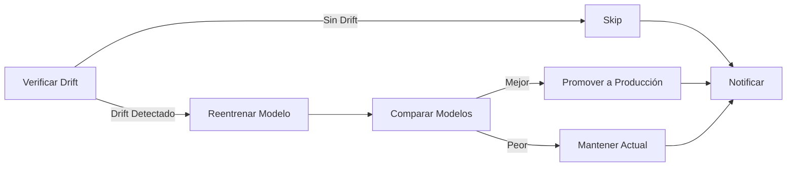

# 🎬 Movie Sentiment MLOps

Un proyecto completo de MLOps para clasificación de sentimientos en reseñas de películas con pipeline de reentrenamiento automático.

## Características

- **Machine Learning**: Clasificación de sentimientos usando TF-IDF con múltiples modelos (Logistic Regression, Random Forest, XGBoost)
- **Optimización Bayesiana**: Búsqueda inteligente de hiperparámetros con scikit-optimize
- **MLflow**: Tracking de experimentos y registro de modelos
- **FastAPI**: API REST para servir predicciones
- **Streamlit**: Interfaz web interactiva
- **Monitoreo de Drift**: Detección automática de drift con Evidently
- **Pipeline Automatizado**: Reentrenamiento automático con Apache Airflow
- **Docker**: Containerización de todos los servicios
- **Testing**: Suite de pruebas con pytest

## Quick Start

### Opción 1: Ejecución Local

1. **Clonar el repositorio**
```bash
git clone <tu-repositorio>
cd movie-sentiment-mlops
```

2. **Crear ambiente virtual**
```bash
python -m venv venv
source venv/bin/activate  # En Windows: venv\Scripts\activate
```

3. **Instalar dependencias**
```bash
pip install -r requirements.txt
pip install Flask-Session==0.5.0  # Para Airflow
```

4. **Entrenar el modelo inicial**
```bash
# Opción 1: Entrenamiento básico
python src/train.py --model logistic_regression

# Opción 2: Con optimización bayesiana (recomendado)
python src/train_bayesian.py --model xgboost

# Opción 3: Comparar múltiples modelos
python src/train_bayesian.py --model compare
```

5. **Configurar monitoreo**
```bash
# Crear datos de referencia para detección de drift
python monitoring/setup_monitoring.py
```

6. **Iniciar MLflow UI** (opcional)
```bash
mlflow ui
# Abrir http://localhost:5000
```

7. **Iniciar la API**
```bash
python app/api.py
# API disponible en http://localhost:8000
# Documentación en http://localhost:8000/docs
```

8. **Iniciar Streamlit**
```bash
streamlit run app/streamlit_app.py
# Abrir http://localhost:8501
```

### Opción 2: Usando Docker Compose

```bash
# Construir y ejecutar todos los servicios base
docker-compose up --build

# Servicios disponibles:
# - MLflow: http://localhost:5000
# - API: http://localhost:8000/docs
# - Streamlit: http://localhost:8501
```

## 🔄 Pipeline de Reentrenamiento Automático (Airflow)

### Configuración Inicial

1. **Instalar Apache Airflow**
```bash
pip install apache-airflow==2.7.3
pip install Flask-Session==0.5.0  # Dependencia necesaria
```

2. **Configurar Airflow**
```bash
# Hacer el script ejecutable
chmod +x setup_airflow.sh

# Ejecutar configuración
./setup_airflow.sh
```

3. **Iniciar Airflow**
```bash
# Opción 1: Modo standalone (más simple)
export AIRFLOW_HOME=$(pwd)/airflow
export AIRFLOW_HOME=$(pwd)/airflowexport AIRFLOW_HOME=$(pwd)/airflow
# Opción 2: Servicios separados
# Terminal 1 - Scheduler:
export AIRFLOW_HOME=$(pwd)/airflow
airflow scheduler

# Terminal 2 - Webserver:
export AIRFLOW_HOME=$(pwd)/airflow
airflow webserver --port 8080
```

4. **Acceder a Airflow UI**
- URL: http://localhost:8080
- Usuario: admin
- Password: (se muestra en la terminal o usar 'admin' si configuraste manualmente)

### Pipeline Automatizado

El pipeline ejecuta automáticamente las siguientes tareas:



**Características del Pipeline:**
- **Monitoreo Diario**: Verifica drift en las distribuciones de datos
- **Reentrenamiento Condicional**: Solo entrena si detecta drift significativo
- **Evaluación Automática**: Compara nuevo modelo vs producción
- **Promoción Inteligente**: Solo promueve si mejora métricas (F1-score)
- **Trazabilidad**: Logs completos y notificaciones de cada paso

### Probar el Pipeline

```bash
# Test manual del monitoreo de drift
python monitoring/drift_monitor.py --airflow

# Test completo del DAG
export AIRFLOW_HOME=$(pwd)/airflow
airflow dags test movie_sentiment_retrain $(date +%Y-%m-%d)

# Ver logs
tail -f airflow/logs/dag_id=movie_sentiment_retrain/run_id=*/task_id=*/*.log
```

## Estructura del Proyecto

```
movie-sentiment-mlops/
├── app/
│   ├── api.py                 # API REST con FastAPI
│   └── streamlit_app.py       # Interfaz web
├── src/
│   ├── train.py              # Entrenamiento básico
│   ├── train_bayesian.py     # Entrenamiento con optimización
│   ├── model_comparator.py   # Comparación de modelos
│   └── utils.py              # Utilidades compartidas
├── monitoring/
│   ├── drift_monitor.py      # Monitor de drift con Evidently
│   └── setup_monitoring.py   # Configuración inicial
├── airflow/                  # Directorio de Airflow (generado)
│   ├── dags/                # DAGs de Airflow
│   ├── logs/                # Logs de ejecución
│   └── airflow.db           # Base de datos SQLite
├── data/                     # Datasets
├── models/                   # Modelos entrenados
│   ├── production.pkl       # Modelo en producción
│   └── *.pkl               # Otros modelos
├── mlruns/                  # Experimentos MLflow
├── monitoring_data/         # Datos de monitoreo
│   ├── reference_data.parquet
│   ├── drift_report_*.html
│   └── airflow/           # Resultados para Airflow
├── tests/
│   └── test_api.py         # Tests unitarios
├── docker-compose.yml       # Orquestación de servicios
├── Dockerfile              # Imagen Docker base
├── requirements.txt        # Dependencias Python
├── setup_airflow.sh       # Script configuración Airflow
├── .env                   # Variables de entorno
└── README.md             # Este archivo
```

## API Endpoints

### Predicción Simple
```bash
curl -X POST "http://localhost:8000/predict" \
  -H "Content-Type: application/json" \
  -d '{"text": "This movie was amazing!"}'
```

### Predicción por Lotes
```bash
curl -X POST "http://localhost:8000/predict/batch" \
  -H "Content-Type: application/json" \
  -d '{"reviews": ["Great movie!", "Terrible film."]}'
```

### Health Check
```bash
curl "http://localhost:8000/health"
```

### Reload Model
```bash
curl -X POST "http://localhost:8000/reload-model"
```

## Monitoreo y Métricas

### MLflow
- Experimentos: http://localhost:5000
- Tracking de métricas: accuracy, precision, recall, F1
- Versionado de modelos
- Comparación de runs

### Evidently (Drift Monitoring)
- Detección de drift en distribuciones
- Métricas de calibración (ECE)
- Reportes HTML interactivos
- Alertas automáticas

### Métricas Monitoreadas
- **Data Drift**: Cambios en distribución de features
- **Prediction Drift**: Cambios en distribución de predicciones
- **Confidence Drift**: Cambios en confianza del modelo
- **Performance**: F1, Accuracy, Precision, Recall

## Testing

```bash
# Ejecutar todos los tests
pytest tests/

# Con cobertura
pytest --cov=src tests/

# Tests específicos
pytest tests/test_api.py -v

# Ignorar warnings
pytest -W ignore tests/
```

## Configuración

Variables de entorno en `.env`:
```bash
# MLflow
MLFLOW_TRACKING_URI=http://localhost:5000
MODEL_NAME=movie_sentiment_classifier
MODEL_STAGE=Production

# API
API_HOST=0.0.0.0
API_PORT=8000

# Monitoring
DRIFT_THRESHOLD=0.15

# Airflow
AIRFLOW_HOME=./airflow
```

## Troubleshooting

### Problema: ModuleNotFoundError en Airflow
```bash
# Solución:
pip install Flask-Session==0.5.0
```

### Problema: DAG no aparece en Airflow UI
```bash
# Verificar logs
cat $AIRFLOW_HOME/logs/scheduler/*.log

# Reiniciar scheduler
kill -9 $(lsof -t -i :8080)
pkill -f "airflow scheduler"
airflow scheduler
```

### Problema: Error de permisos
```bash
# Dar permisos de ejecución
chmod +x setup_airflow.sh
chmod -R 755 airflow/
```

### Problema: Puerto en uso
```bash
# Verificar procesos
lsof -i :8080  # Airflow
lsof -i :8000  # FastAPI
lsof -i :5000  # MLflow

# Terminar proceso
kill -9 $(lsof -ti :8080)
```

## Próximos Pasos

### Mejoras Inmediatas
- [ ] Implementar caché con Redis
- [ ] Agregar autenticación JWT a la API
- [ ] Configurar alertas por email/Slack
- [ ] Implementar data versioning con DVC

### Mejoras Avanzadas
- [ ] Migrar a Kubernetes para escalabilidad
- [ ] Implementar A/B testing
- [ ] Feature store con Feast
- [ ] CI/CD con GitHub Actions
- [ ] Observabilidad con Prometheus/Grafana

## Recursos y Documentación

- [FastAPI Docs](https://fastapi.tiangolo.com/)
- [MLflow Guide](https://mlflow.org/docs/latest/index.html)
- [Airflow Documentation](https://airflow.apache.org/docs/)
- [Evidently AI](https://docs.evidentlyai.com/)
- [Streamlit Docs](https://docs.streamlit.io/)

## Licencia

Este proyecto es de código abierto y está disponible bajo la licencia MIT.

---

## Nota Importante sobre el Reentrenamiento Automático
El pipeline de reentrenamiento automático implementado en este proyecto detecta exitosamente el drift en los datos de producción y ejecuta el proceso de reentrenamiento; sin embargo, es crucial entender que en su estado actual, el sistema reentrena utilizando los mismos datos originales del dataset IMDB debido a una limitación fundamental: los datos de producción que causan el drift no vienen etiquetados. En un escenario real de producción, este enfoque sería inefectivo ya que no resolvería el problema del drift. Para implementar un reentrenamiento verdaderamente útil, sería necesario primero establecer un mecanismo de obtención de etiquetas para los nuevos datos, como: un sistema de feedback donde usuarios validen predicciones, un proceso de etiquetado manual periódico o active learning para priorizar qué ejemplos etiquetar. Este proyecto demuestra la infraestructura y arquitectura MLOps necesaria para el reentrenamiento automático, pero en aplicaciones reales, resolver el problema del etiquetado continuo es prerequisito para que el pipeline genere valor real. El reentrenamiento actual sirve principalmente como demostración técnica del flujo completo de MLOps, desde la detección de drift hasta la promoción de modelos, pero no mejorará el rendimiento del modelo en los nuevos patrones de datos detectados.

## Mejora Recomendada: Promoción de Modelos con MLflow Registry
Actualmente la promoción de modelos se realiza copiando archivos .pkl directamente, lo cual es funcional pero carece de versionado y trazabilidad. Se recomienda migrar al MLflow Model Registry que ya está instalado en el proyecto, permitiendo transiciones controladas entre estados (Experimental → Staging → Production), versionado semántico, metadata detallada de cada modelo, y rollback instantáneo si falla en producción. La implementación requeriría modificar train_bayesian.py para registrar modelos con mlflow.register_model(), actualizar model_comparator.py para usar client.transition_model_version_stage() al promover, y cambiar api.py para cargar desde el registry con mlflow.pyfunc.load_model("models:/movie_sentiment_classifier/Production").

---

**Desarrollado para aprender MLOps end-to-end** 
**Desde el entrenamiento hasta producción con monitoreo y reentrenamiento automático.

